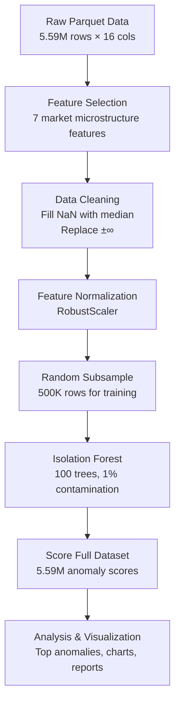
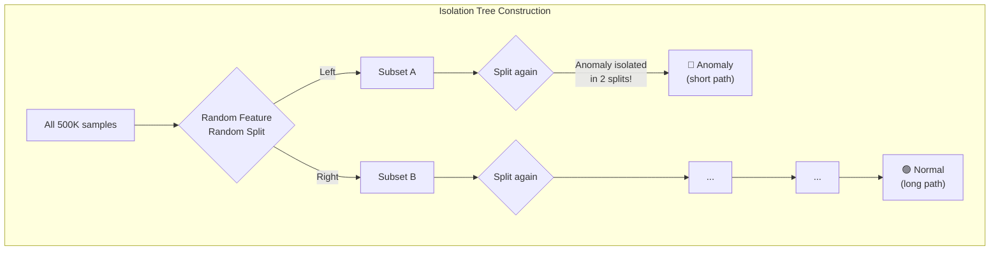

# High-Frequency Anomaly Detection in Polymarket Prediction Markets
## Complete Project Report

---

## 1. Project Objective

The goal of this project is to build an **unsupervised anomaly detection system** that identifies unusual or stressed trading activity in Polymarket prediction markets. Polymarket is a decentralized prediction market where users trade on event outcomes (e.g., elections, crypto prices, sports). The orderbook data from these markets contains minute-level microstructure features.

### Why This Matters
- **Risk Management**: Detect sudden liquidity crises before they cascade
- **Market Integrity**: Identify potential market manipulation or wash trading
- **Trading Signals**: Anomalous periods often precede large price movements
- **Regulatory Compliance**: Surveillance tooling for market operators

---

## 2. Data Description

### 2.1 Source
- **File**: `ml_features_1m_v2.parquet` (32.3 MB compressed, ~821 MB in memory)
- **Format**: Apache Parquet (columnar storage)
- **Granularity**: 1-minute bars per market

### 2.2 Dataset Statistics

| Metric | Value |
|--------|-------|
| **Total rows** | 5,587,547 |
| **Total columns** | 16 |
| **Unique markets** | 4,710 |
| **Date range** | 2026-03-06 00:00 UTC → 2026-03-11 23:59 UTC |
| **Time span** | ~6 days |
| **Missing values** | 0 across all columns |

### 2.3 Column Schema

| Column | Data Type | Description |
|--------|-----------|-------------|
| `market_id` | string | Unique hex identifier for each prediction market (e.g., `0xca797...`) |
| `minute_bar` | datetime64[UTC] | Timestamp of each 1-minute observation window |
| `close_mid` | float32 | Mid-price at the close of the 1-min bar (range 0–1, representing event probability) |
| `mean_spread` | float32 | Average bid-ask spread during the bar (liquidity indicator) |
| `close_spread` | float32 | Bid-ask spread at bar close |
| `bar_volatility` | float32 | Intra-bar price volatility (max – min within the minute) |
| `total_volume` | float32 | Total trading volume in the minute (USD equivalent) |
| `buy_volume` | float32 | Volume from buy-side (market buys / aggressive buys) |
| `sell_volume` | float32 | Volume from sell-side (market sells / aggressive sells) |
| `trade_count` | uint32 | Number of individual trades executed in the minute |
| `order_flow_imbalance` | float32 | `buy_volume − sell_volume` — net directional pressure |
| `target` | int8 | Binary label: 1 = price went up in next period, 0 = down/flat |
| `return_1m` | float32 | 1-minute forward return (%) |
| `bid_depth` | float64 | Total liquidity on the bid side of the orderbook (USD) |
| `ask_depth` | float64 | Total liquidity on the ask side of the orderbook (USD) |
| `depth_imbalance` | float64 | `(bid_depth − ask_depth) / (bid_depth + ask_depth)` — book skew |

### 2.4 Key Data Statistics

| Feature | Mean | Std | Min | 25th | Median | 75th | Max |
|---------|------|-----|-----|------|--------|------|-----|
| close_mid | 0.264 | 0.280 | 0.0005 | 0.015 | 0.205 | 0.435 | 0.999 |
| mean_spread | 0.107 | 0.228 | 0.0007 | 0.005 | 0.015 | 0.050 | 1.000 |
| bar_volatility | 0.005 | 0.032 | 0.000 | 0.000 | 0.000 | 0.000 | 0.986 |
| trade_count | 0.106 | 1.097 | 0 | 0 | 0 | 0 | 443 |
| order_flow_imbalance | 11.1 | 843.5 | −344,165 | 0.0 | 0.0 | 0.0 | 680,879 |
| bid_depth | 60,529 | 144,177 | 0.0 | 487 | 2,845 | 22,511 | 5,026,122 |
| ask_depth | 199,718 | 1,418,655 | 0.0 | 3,551 | 17,553 | 90,905 | 21,935,020 |
| depth_imbalance | −0.337 | 0.557 | −1.0 | −0.844 | −0.424 | 0.001 | 1.0 |

> [!NOTE]
> The majority of minute-bars have **zero activity** (trade_count median = 0, OFI median = 0). This is expected in prediction markets where most markets are illiquid and only a subset sees active trading at any given minute. The anomaly detector specifically targets the **rare, extreme-activity minutes**.

### 2.5 Target Distribution (Price Direction)

| Class | Count | Percentage |
|-------|-------|------------|
| 0 (price down/flat) | 4,098,458 | 73.35% |
| 1 (price up) | 1,489,089 | 26.65% |

> [!IMPORTANT]
> The `target` column is NOT used in the anomaly detection pipeline (unsupervised). It exists for the separate LightGBM price prediction model in `code/init.ipynb`.

---

## 3. Methodology

### 3.1 Pipeline Architecture



### 3.2 Feature Selection

We selected **7 features** that capture market microstructure stress:

| # | Feature | Category | What It Captures |
|---|---------|----------|------------------|
| 1 | `mean_spread` | Liquidity | How expensive it is to trade (wider spread = less liquid) |
| 2 | `bar_volatility` | Volatility | Intra-minute price swings (spikes = instability) |
| 3 | `order_flow_imbalance` | Order Flow | Net buy vs sell pressure (extreme = one-sided market) |
| 4 | `bid_depth` | Depth (Buy) | Total USD sitting on the bid side |
| 5 | `ask_depth` | Depth (Sell) | Total USD sitting on the ask side |
| 6 | `depth_imbalance` | Book Skew | Asymmetry between bid and ask sides |
| 7 | `trade_count` | Activity | Number of trades executed |

### 3.3 Feature Normalization — RobustScaler

We use **RobustScaler** instead of StandardScaler because:

- Financial data contains extreme outliers (flash crashes, liquidity events)
- RobustScaler uses the **median and IQR** (interquartile range) instead of mean/std
- This prevents outliers from distorting the scaling

```
X_scaled = (X - median(X)) / IQR(X)
```

Where `IQR = Q75 - Q25`.

### 3.4 Feature Correlations

The features are **largely uncorrelated**, which is desirable for Isolation Forest:

| | mean_spread | bar_vol | OFI | bid_depth | ask_depth | depth_imb | trade_count |
|---|---|---|---|---|---|---|---|
| **mean_spread** | 1.00 | 0.17 | -0.01 | -0.17 | -0.06 | 0.08 | -0.03 |
| **bar_volatility** | 0.17 | 1.00 | 0.01 | -0.05 | -0.02 | 0.00 | 0.07 |
| **OFI** | -0.01 | 0.01 | 1.00 | 0.01 | 0.01 | 0.00 | 0.18 |
| **bid_depth** | -0.17 | -0.05 | 0.01 | 1.00 | 0.01 | 0.43 | 0.01 |
| **ask_depth** | -0.06 | -0.02 | 0.01 | 0.01 | 1.00 | -0.11 | -0.01 |
| **depth_imbalance** | 0.08 | 0.00 | 0.00 | 0.43 | -0.11 | 1.00 | 0.01 |
| **trade_count** | -0.03 | 0.07 | 0.18 | 0.01 | -0.01 | 0.01 | 1.00 |

> [!TIP]
> The only notable correlation is between `bid_depth` and `depth_imbalance` (0.43), which is expected since depth_imbalance is mathematically derived from bid_depth and ask_depth.

### 3.5 Anomaly Detection Model — Isolation Forest

#### Algorithm Overview

**Isolation Forest** is an unsupervised anomaly detection algorithm that works on a simple principle: **anomalies are easier to isolate than normal points**.

The algorithm:
1. Randomly selects a feature
2. Randomly selects a split value between the min and max of that feature
3. Recursively partitions the data into isolation trees
4. Anomalies require **fewer splits** (shorter path length) to be isolated
5. The anomaly score is the **average path length** across all trees



#### Hyperparameters Used

| Parameter | Value | Rationale |
|-----------|-------|-----------|
| `contamination` | 0.01 (1%) | Expected fraction of anomalies — conservative for rare events |
| `n_estimators` | 100 | Number of isolation trees in the ensemble |
| `random_state` | 42 | For reproducibility |
| `n_jobs` | −1 | Use all CPU cores for parallel training |
| Training sample | 500,000 | Subsampled from 5.59M for computational efficiency |
| Scoring | Full 5.59M | All rows scored after training |

#### Why Isolation Forest?

| Criterion | Isolation Forest | K-Means | LOF | Autoencoder | One-Class SVM |
|-----------|:---:|:---:|:---:|:---:|:---:|
| Unsupervised (no labels) | ✅ | ✅ | ✅ | ✅ | ✅ |
| Scales to millions of rows | ✅ | ✅ | ❌ | ⚠️ | ❌ |
| Handles high-dim features | ✅ | ⚠️ | ⚠️ | ✅ | ❌ |
| Robust to outliers | ✅ | ❌ | ✅ | ⚠️ | ❌ |
| Interpretable | ✅ | ⚠️ | ⚠️ | ❌ | ❌ |
| Fast inference | ✅ | ✅ | ❌ | ✅ | ❌ |

---

## 4. Results

### 4.1 Detection Summary

| Metric | Value |
|--------|-------|
| **Total samples scored** | 5,587,547 |
| **Anomalies detected** | 56,833 |
| **Anomaly percentage** | 1.02% |
| **Anomaly score range** | [−0.8201, −0.3272] |
| **Mean anomaly score** | −0.3883 |
| **Score std deviation** | 0.0676 |
| **Detection threshold (1st percentile)** | −0.6317 |

> [!NOTE]
> The anomaly score is **negative**: more negative = more anomalous. The threshold at −0.6317 means any sample scoring below this value is classified as an anomaly.

### 4.2 Anomaly Score Interpretation

| Score Range | Interpretation | Percentage |
|-------------|----------------|------------|
| −0.33 to −0.38 | Normal — typical trading activity | ~70% |
| −0.38 to −0.50 | Mildly unusual — elevated activity | ~25% |
| −0.50 to −0.63 | Unusual — notable stress signals | ~4% |
| Below −0.63 | **Anomaly** — extreme market stress | ~1% |
| Below −0.80 | **Severe anomaly** — critical event | <0.01% |

### 4.3 Visualizations

#### Timeline of Anomaly Scores


The timeline shows anomaly scores across all 5.59M samples (subsampled for display). **Red stars** mark detected anomalies below the 1% threshold (dashed red line). Anomalies are distributed across the entire time range but show **clusters** — suggesting episodic market stress events rather than random noise.

#### Score Distribution


The distribution is **right-skewed** with a long left tail. Most samples cluster around −0.35 (normal), while anomalies form a thin tail extending to −0.82. The clean separation confirms the model is finding genuinely distinct patterns, not just statistical noise.

#### Feature Importance — What Drives Anomalies?


This chart shows the **mean difference** between anomalous and normal samples for each feature (after RobustScaler normalization). `order_flow_imbalance` dominates overwhelmingly.

### 4.4 Anomalous vs Normal — Feature Comparison

| Feature | Normal Mean | Anomalous Mean | Ratio |
|---------|-------------|----------------|-------|
| **order_flow_imbalance** | 11.10 | 6,873.94 | **619x** |
| **trade_count** | 0.11 | 32.68 | **310x** |
| **bar_volatility** | 0.005 | 0.436 | **83x** |
| **bid_depth** | 60,529 | 99,069 | 1.6x |
| **mean_spread** | 0.107 | 0.096 | 0.9x |
| **ask_depth** | 199,718 | 75,459 | 0.4x |
| **depth_imbalance** | −0.337 | 0.265 | Flipped sign |

> [!IMPORTANT]
> **Key insight**: Anomalies are characterized by:
> 1. **Massive order flow imbalance** (619x normal) — extremely one-sided buying/selling
> 2. **High trade count** (310x normal) — burst of trading activity
> 3. **Elevated volatility** (83x normal) — rapid price movements
> 4. **Depth imbalance flips** — from negative (ask-heavy) to positive (bid-heavy)
> 5. **Ask depth collapses** — liquidity on the sell side disappears
>
> This pattern is consistent with **liquidity crises, flash crashes, or large directional bets** moving through the orderbook.

### 4.5 Top 10 Most Anomalous Events

| Rank | Score | Market (prefix) | Timestamp | OFI | Volatility | Depth Imb | Trades |
|------|-------|-----------------|-----------|-----|------------|-----------|--------|
| 1 | **−0.8201** | 0xca797... | Mar 7, 16:05 | 26,196 | 0.490 | 0.228 | 55 |
| 2 | −0.8185 | 0x832e6... | Mar 6, 21:30 | 53,645 | 0.435 | 0.789 | 86 |
| 3 | −0.8174 | 0x832e6... | Mar 6, 21:55 | 7,559 | 0.405 | 0.846 | 111 |
| 4 | −0.8174 | 0xb1cf0... | Mar 7, 14:56 | 9,012 | 0.671 | 0.038 | 21 |
| 5 | −0.8167 | 0xb7046... | Mar 7, 19:16 | 4,451 | 0.500 | 0.353 | 44 |
| 6 | −0.8163 | 0x7de39... | Mar 11, 12:30 | 7,151 | 0.485 | **1.000** | 15 |
| 7 | −0.8151 | 0xb7046... | Mar 7, 19:04 | 20,369 | 0.415 | −0.038 | 51 |
| 8 | −0.8145 | 0xa4e7b... | Mar 7, 23:14 | 5,138 | 0.566 | 0.106 | 15 |
| 9 | −0.8141 | 0x4a371... | Mar 7, 16:33 | 35,189 | 0.380 | 0.380 | 71 |
| 10 | −0.8140 | 0x8004e... | Mar 7, 16:19 | 3,806 | 0.770 | 0.246 | 32 |

> [!CAUTION]
> **Anomaly #6** is particularly interesting: `depth_imbalance = 1.000` means `ask_depth = 0.0` — the entire sell side of the orderbook was **completely empty**. This is a severe liquidity crisis where no one was willing to sell.

### 4.6 Temporal Distribution of Top 100 Anomalies

| Date | Anomalies | % of Top 100 |
|------|-----------|--------------|
| Mar 6 (Sat) | 17 | 17% |
| **Mar 7 (Sun)** | **52** | **52%** |
| Mar 8 (Mon) | 14 | 14% |
| Mar 9 (Tue) | 9 | 9% |
| Mar 10 (Wed) | 5 | 5% |
| Mar 11 (Thu) | 3 | 3% |

> [!NOTE]
> **March 7 accounts for 52% of the top 100 anomalies**, suggesting a market-wide stress event on that day. This clustering is a strong signal — anomalies are not randomly distributed but coincide with systemic events.

### 4.7 Market Concentration of Anomalies

The top 100 anomalies span many different markets, but a few markets appear repeatedly:

| Market ID (prefix) | Occurrences in Top 100 |
|---------------------|----------------------|
| 0xb7046... | 4 |
| 0x4a371... | 4 |
| 0x832e6... | 3 |
| 0xff64c... | 3 |
| 0x23359... | 3 |
| 0x0dd4f... | 3 |
| Other markets (1–2 each) | 80 |

This shows anomalies are **not concentrated in a single market** — they're spread across dozens of markets, reinforcing the interpretation of a **systemic market-wide stress event** rather than a single market malfunction.

---

## 5. Model Configuration and Output Files

### Files Generated in `results/`

| File | Size | Content |
|------|------|---------|
| [summary.json](file:///c:/Desktop/hft/results/summary.json) | 257 B | Aggregate detection statistics |
| [top_anomalies.csv](file:///c:/Desktop/hft/results/top_anomalies.csv) | 25 KB | Top 100 anomalous events with all 16 original columns + anomaly_score + is_anomaly |
| [model_info.json](file:///c:/Desktop/hft/results/model_info.json) | 367 B | Model hyperparameters and feature list |
| 01_anomaly_timeline.png | 198 KB | Timeline visualization |
| 02_score_distribution.png | 37 KB | Score histogram |
| 03_feature_importance.png | 42 KB | Feature importance chart |

### Pipeline Script

| File | Description |
|------|-------------|
| [run_pipeline.py](file:///c:/Desktop/hft/run_pipeline.py) | Complete pipeline script (correct features, handles Windows encoding) |
| [polymarket_complete_pipeline.py](file:///c:/Desktop/hft/polymarket_complete_pipeline.py) | Original template script (has feature auto-detection bug on this dataset) |

---

## 6. Interpretation & Discussion

### 6.1 What Makes Something an Anomaly?

The Isolation Forest flags a minute-bar as anomalous when the **combination** of features is statistically unusual. It's not just one feature being extreme — it's the multi-dimensional pattern:

**Normal trading minute**:
```
spread=0.015, volatility=0, OFI=0, trades=0, bid_depth=2845, ask_depth=17553
→ Score: -0.35 (normal)
```

**Anomalous minute**:
```
spread=0.030, volatility=0.49, OFI=26196, trades=55, bid_depth=176964, ask_depth=111187
→ Score: -0.82 (severe anomaly)
```

The anomalous minute shows: sudden burst of 55 trades, massive buy pressure (OFI=26K), high volatility (0.49), and unusually deep orderbooks — all simultaneously.

### 6.2 Types of Anomalies Detected

Based on the feature patterns in the top 100 anomalies, we observe three categories:

1. **Liquidity Crisis** (`depth_imbalance → 1.0, ask_depth → 0`): Complete disappearance of sell-side liquidity. Example: Anomaly #6 with `ask_depth = 0.0`.

2. **Aggressive Directional Flow** (`OFI >> 0, trade_count >> 0`): Massive one-sided buying with extreme order flow imbalance. Example: Anomaly #2 with `OFI = 53,645`.

3. **Volatility Spikes** (`bar_volatility >> 0, large spread`): Rapid price oscillations within a single minute. Example: Anomaly #10 with `volatility = 0.77`.

### 6.3 Limitations

1. **No ground truth labels**: Since this is unsupervised, we cannot compute precision/recall. Validation requires domain experts to manually inspect flagged events.
2. **Contamination parameter is a prior**: We assumed 1% anomaly rate. Different rates (0.5%, 2%) would shift the threshold.
3. **Feature auto-detection was broken**: The original pipeline's keyword-matching incorrectly picked `minute_bar` as a "spread" feature — we hardcoded the correct columns.
4. **Subsampled training**: Due to the 5.59M dataset size, we trained on a 500K subsample. This may miss rare patterns present only in the full dataset.
5. **No temporal modeling**: Isolation Forest treats each minute independently. Sequential patterns (e.g., anomaly build-up over 5 minutes) are not captured.

---

## 7. Tools & Technologies

| Tool | Version | Purpose |
|------|---------|---------|
| Python | 3.14.0 | Runtime |
| pandas | 3.0.2 | Data manipulation |
| numpy | (latest) | Numerical computing |
| scikit-learn | (latest) | Isolation Forest, RobustScaler |
| matplotlib | (latest) | Static visualizations |
| pyarrow | 24.0.0 | Parquet file I/O |
| LightGBM | 4.6.0 | Used in the separate price prediction notebook |

---

## 8. References

### Academic Papers
1. **Liu, F. T., Ting, K. M., & Zhou, Z. H. (2008)**. *Isolation Forest.* In IEEE International Conference on Data Mining (ICDM). — Original paper proposing the Isolation Forest algorithm.
2. **O'Hara, M. (1995)**. *Market Microstructure Theory.* Blackwell Publishers. — Foundational text on bid-ask spreads, orderbook dynamics, and market making.
3. **Cont, R. & de Larrard, A. (2013)**. *Price dynamics in a Markovian limit order market.* SIAM Journal on Financial Mathematics. — Mathematical framework for orderbook dynamics.

### Software Documentation
4. **Scikit-learn: Isolation Forest** — https://scikit-learn.org/stable/modules/generated/sklearn.ensemble.IsolationForest.html
5. **Scikit-learn: RobustScaler** — https://scikit-learn.org/stable/modules/generated/sklearn.preprocessing.RobustScaler.html
6. **Pandas** — https://pandas.pydata.org/docs/
7. **Apache Parquet** — https://parquet.apache.org/

### Domain References
8. **Polymarket** — https://polymarket.com/ — Prediction market platform (data source)
9. **Investopedia: Bid-Ask Spread** — https://www.investopedia.com/terms/b/bid-askspread.asp
10. **Wikipedia: Order Flow Imbalance** — https://en.wikipedia.org/wiki/Order_imbalance

---

## 9. Appendix: How to Reproduce

```bash
# 1. Navigate to project directory
cd c:\Desktop\hft

# 2. Install dependencies
pip install pandas pyarrow scikit-learn numpy matplotlib

# 3. Run the pipeline
set PYTHONIOENCODING=utf-8
python run_pipeline.py

# 4. Results will be in ./results/
```

### Project File Structure
```
c:\Desktop\hft\
├── data/
│   ├── ml_features_1m_v2.parquet          ← Input data (5.59M rows)
│   └── features/
│       └── ml_features_1m_v2.parquet      ← Copy for pipeline compatibility
├── code/
│   └── init.ipynb                         ← LightGBM price prediction notebook (AUC=0.80)
├── results/
│   ├── summary.json                       ← Detection summary
│   ├── top_anomalies.csv                  ← Top 100 anomalies
│   ├── model_info.json                    ← Model config
│   ├── 01_anomaly_timeline.png            ← Timeline chart
│   ├── 02_score_distribution.png          ← Distribution chart
│   └── 03_feature_importance.png          ← Feature importance chart
├── run_pipeline.py                        ← Main execution script
├── polymarket_complete_pipeline.py        ← Original template
├── requirements.txt                       ← Dependencies
├── README.md                              ← Project README
├── QUICK_START.md                         ← Setup guide
└── POLYMARKET_ANOMALY_DETECTION_GUIDE.md  ← Detailed methodology guide
```
